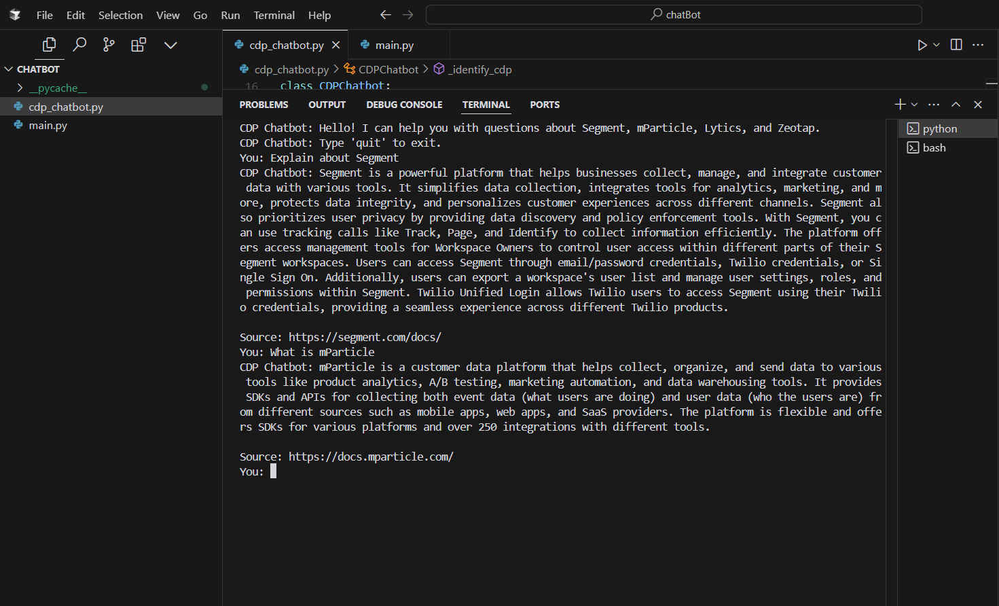

# CDP Documentation Chatbot

An intelligent chatbot that helps users find information about various Customer Data Platforms (CDPs) by leveraging documentation from Segment, mParticle, Lytics, and Zeotap.

## Screenshot:



## Features

- **Multi-CDP Support**: Handles documentation from multiple CDP providers.
- **Semantic Search**: Uses BERT-based embeddings for intelligent document matching.
- **Natural Language Processing**: Leverages NLTK for text processing.
- **OpenAI Integration**: Generates human-like responses using GPT-3.5.
- **Web Scraping**: Automatically fetches and processes documentation.
- **Error Handling**: Robust error management and progress tracking.

## Prerequisites

### Required Packages

Ensure you have the following dependencies installed:

- `nltk`
- `requests`
- `beautifulsoup4`
- `sentence-transformers`
- `numpy`
- `openai`
- `urllib3`

### Configuration

1. Set up your OpenAI API key.
2. Ensure you have internet access for:
   - Documentation fetching
   - NLTK downloads
   - OpenAI API calls

## Usage

### Run the Chatbot

```sh
python chatbot.py
```

### Initialization Process

- The bot will fetch documentation from all supported CDPs.
- It will process the content and generate embeddings.
- Progress updates will be displayed.

### Ask Questions

- You can ask questions about any supported CDP.
- Type `'quit'` to exit.

## Architecture

### CDPChatbot Class

#### Main Components

- **Documentation Fetching** (`_fetch_documentation`)
- **Content Processing** (`_process_page`)
- **Semantic Search** (using SentenceTransformer)
- **Question Answering** (using OpenAI)

### Key Features

#### Documentation Processing

- Fetches docs from CDP websites.
- Processes HTML content.
- Extracts relevant information.
- Generates semantic embeddings.

#### Question Processing

- CDP identification.
- Question cleaning.
- Intent recognition.
- Context matching.

#### Answer Generation

- Context retrieval.
- OpenAI integration.
- Fallback mechanisms.
- Source attribution.

## Error Handling

The system includes comprehensive error handling for:

- Network issues.
- Rate limiting.
- Content parsing.
- API failures.
- Invalid inputs.

## Limitations

- Limited to 10 documentation pages per CDP.
- Requires an internet connection.
- Rate limited for documentation fetching.
- Depends on CDP documentation structure.
- Requires an OpenAI API key.

## Project Structure

```sh
CDP-Chatbot/
│── chatbot.py
│── requirements.txt
│── README.md
│── LICENSE
│── data/
│── models/
```

## Quick Start

1. Clone the repository:

   ```sh
   git clone https://github.com/yourusername/CDP-Chatbot.git
   ```

2. Install dependencies:

   ```sh
   pip install -r requirements.txt
   ```

3. Set up OpenAI API key.
4. Run the chatbot:

   ```sh
   python chatbot.py
   ```

## Contributing

1. Fork the repository.
2. Create your feature branch:
   ```sh
   git checkout -b feature/amazing-feature
   ```
3. Commit your changes:
   ```sh
   git commit -m 'Add some amazing feature'
   ```
4. Push to the branch:
   ```sh
   git push origin feature/amazing-feature
   ```
5. Open a Pull Request.

## License

This project is licensed under the MIT License - see the [LICENSE](LICENSE) file for details.

## Acknowledgments

- **OpenAI** for GPT-3.5
- **Sentence-Transformers** for semantic search
- **Beautiful Soup** for web scraping
- **NLTK** for text processing

## Support

For support, please open an issue in the repository or contact [anurag180203@gmail.com](mailto:anurag180203@gmail.com).
